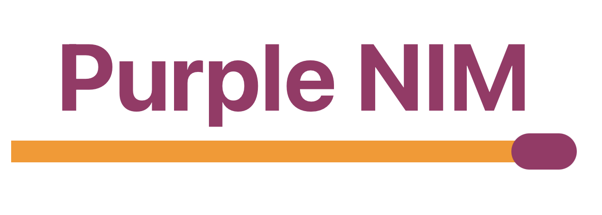

##  Overview

Purple Nim is an app that allows you to play the famous NIM game. The rules are very simple, players must take between 1 and 3 matches each in turn. Whoever takes the last match has lost. 

## Project 

1. This application was created for Purple Giraffe challenges.    
2. [ Purple Giraffe]("https://purplegiraffe.fr") is an online training platform specializing in mobile development.   
  
## Features

*  Play with a friend or against the IA. You can even let the IA compete against each other. 
*  Customize the number of matches between 2 and 50. 
*  Customize IA between 3 levels: Stupid, Human and Einstein.
*  The color of the player can be customized.

## Screenshots

 |  |  | 

## Todo 

*  Code comment
*  Unit test
*  App Icon 

## Licence 

MIT 

